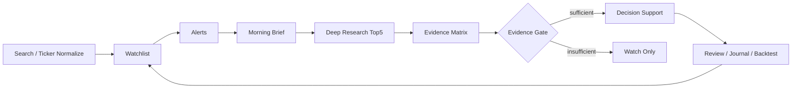

# Financial Codex Workspace

面向 A股研究、观察池管理、交易复盘和策略验证的 Codex 金融研究工作台。


这个仓库不是一个自动交易系统，也不是一个只会堆命令的脚本集合。它把 Codex 的技能路由、A股数据治理、观察池工作流、决策支持护栏、交易复盘、回测和因子研究组织成一个可验证、可追溯、可继续产品化的研究工作区。

核心目标很简单：让每一次研究输出都像专业研究流程，而不是一段随口判断。它必须有来源、有缺口、有证据闸门、有风险边界，也必须在数据不足时诚实降级。

## Highlights（亮点）

- **Router-first 金融任务路由**：所有金融任务先经过 `financial-services-skill-router`，再按 `.agents/SKILLS_INDEX.md` 选择最窄的 downstream skill，避免一上来乱读、乱推理、乱输出。
- **A股优先的数据治理**：内置 `china-market-overlay`，显式处理 A股 ticker、交易日、复权口径、ST/停牌、涨跌停、T+1、整数手、RMB/CNY 和中国披露语境。
- **iFinD-first 数据策略**：同花顺/iFinD 作为优先数据源，AKShare 只作为公开数据 fallback 或交叉验证，并在 `source_log` 中保留接口、参数、时间戳和字段缺口。
- **Evidence Matrix（证据矩阵）**：单股研究不只看 K 线，而是把行情、技术、财务、估值、公告/新闻、同业、资金面、风险事件拆成可审计证据块。
- **证据充分性闸门**：非技术证据不足时，只输出观察结论，不进入条件化决策支持，防止技术分析单独变成交易指令。
- **观察池到晨会闭环**：支持 watchlist、alerts、Morning Brief（晨会简报）、Top10 动态排序、Top5 深研候选和下一步动作。
- **专业研究产物骨架**：生成 tear sheet（一页纸速览）、thesis tracker（投资逻辑跟踪器）、catalyst calendar（催化剂日历）和 comps snapshot（同业对比快照）。
- **交易复盘专业化**：解析券商成交导出，做 FIFO round-trip、行为诊断、规则一致性复盘和 post-trade review（交易后复盘）。
- **回测和因子不是只看收益**：回测输出交易成本、滑点、涨跌停、停牌、T+1、整数手、幸存者偏差、前视偏差等检查；因子研究要求 IC、IR、分层收益、换手率、行业中性、衰减曲线和样本外稳定性。
- **强护栏输出**：禁止无条件买卖建议、目标价、评级、个人仓位、收益承诺。所有高风险输出都带 `Not investment advice`、数据缺口和 QA 状态。

## What It Does（它能做什么）



这个工作区目前覆盖 6 条主线：

| 主线 | 入口 | 产物 |
|---|---|---|
| A股单股研究 | `decision` | company profile、evidence matrix、tear sheet、thesis tracker、catalyst calendar、conditional trade plan |
| 观察池管理 | `watchlist`、`alerts`、`brief` | watchlist JSON、价格提醒、Morning Brief、Top10 动态排序、今日待办 |
| 自然语言路由 | `run` | 从用户意图自动选择 workflow、skills、inputs、QA gate |
| 交易复盘 | `journal` | FIFO round-trip、盈亏画像、行为诊断、规则一致性复盘、post-trade review |
| 回测验证 | `backtest` | Vibe run envelope、轻量本地验证、A股可交易性检查、不可交易原因 |
| 因子研究 | `alpha-bench` | Alpha Zoo 请求骨架、IC/IR 等专业指标要求、source_gap 诊断 |

## Quick Start（快速开始）

从项目根目录运行：

```bash
python3 -m trading_core.cli --help
```

检查 iFinD 环境，不会打印 token：

```bash
python3 -m trading_core.cli check-ifind
```

用自然语言让系统自动路由：

```bash
python3 -m trading_core.cli run --intent "帮我看今天观察池"
python3 -m trading_core.cli run --intent "分析这只票" --ticker 300033.SZ --skip-polymarket
python3 -m trading_core.cli run --intent "复盘我的交易记录" --file uploads/trades.xlsx
python3 -m trading_core.cli run --intent "回测 technical_breakout" --ticker 300033.SZ --strategy technical_breakout --start 2024-01-01 --end 2026-05-23 --dry-run
python3 -m trading_core.cli run --intent "评估 CSI300 的 GTJA191 因子" --universe csi300 --zoo gtja191 --period 2021-2026
```

默认输出是适合人看的 Markdown 卡片。需要完整机器记录时使用：

```bash
python3 -m trading_core.cli run \
  --intent "分析这只票" \
  --ticker 300033.SZ \
  --skip-polymarket \
  --format json \
  --output .research/runs/300033_decision.json
```

## Common Commands（常用命令）

### 1. 搜索和规范化 A股标的

```bash
python3 -m trading_core.cli search --query 同花顺
python3 -m trading_core.cli search --query 300033 --format json
```

### 2. 管理观察池

```bash
python3 -m trading_core.cli watchlist --init
python3 -m trading_core.cli watchlist
python3 -m trading_core.cli watchlist --add 300033.SZ --name 同花顺 --group 金融科技 --priority 1 --tag AI --tag 证券IT
python3 -m trading_core.cli watchlist --update 300033.SZ --set status=research_candidate --set notes=关注量能确认
python3 -m trading_core.cli watchlist --remove 300033.SZ
```

### 3. 设置和检查提醒

```bash
python3 -m trading_core.cli alerts --add 300033.SZ --condition above --level 200 --expires 90d
python3 -m trading_core.cli alerts --check --file .research/alerts/alerts.jsonl
```

### 4. 生成 Morning Brief（晨会简报）

```bash
python3 -m trading_core.cli brief \
  --watchlist .research/watchlists/default.json \
  --store
```

晨会简报会输出：

- 市场环境层的数据缺口和补数事项
- 观察池异动和提醒触发
- Top10 动态排序
- Top5 深研候选
- 每只股票的下一步动作
- `source_log`、QA 状态和 `Not investment advice`

### 5. 单股研究和条件化决策支持

```bash
python3 -m trading_core.cli decision \
  --ticker 300033.SZ \
  --market a_share \
  --start 2026-04-01 \
  --end 2026-06-17 \
  --adjustment-basis unadjusted \
  --skip-polymarket
```

使用本地 OHLCV 文件：

```bash
python3 -m trading_core.cli decision \
  --ticker 300033.SZ \
  --market a_share \
  --ohlcv data/300033_ohlcv.csv \
  --adjustment-basis qfq \
  --format json \
  --output .research/runs/300033_decision.json
```

### 6. 交易日志复盘

```bash
python3 -m trading_core.cli journal --file uploads/trades.csv
python3 -m trading_core.cli journal --file uploads/trades.xlsx --format json
```

输出包含：

- 成交解析和 `source_log`
- FIFO round-trip 盈亏
- win rate、profit/loss profile、holding period
- 追涨、割肉、过度交易、盈利拿不住、亏损扛单、仓位集中等行为诊断
- 规则一致性复盘
- post-trade review

### 7. 回测和因子研究

```bash
python3 -m trading_core.cli backtest \
  --ticker 300033.SZ \
  --strategy technical_breakout \
  --start 2024-01-01 \
  --end 2026-05-23

python3 -m trading_core.cli alpha-bench \
  --universe csi300 \
  --zoo gtja191 \
  --period 2021-2026
```

回测会明确列出哪些检查只是框架级、哪些数据缺失导致策略暂不可交易。因子研究不会把单个因子结果转换为个股交易指令。

## Productized Workflows（产品化工作流）

`.agents/workflows/` 中声明了可复用 workflow recipes：

| Workflow | 用途 |
|---|---|
| `daily_a_share_decision_pipeline.json` | 每日观察池到深研再到条件化决策支持的父流程 |
| `watchlist_daily_review.json` | 观察池动态排序、提醒和晨会简报 |
| `a_share_deep_research.json` | 单股深研、证据矩阵和研究产物 |
| `a_share_decision_support.json` | 证据充分后的条件化决策支持 |
| `trade_journal_shadow_review.json` | 券商成交复盘和 Shadow Account 风格诊断 |
| `vibe_backtest_validation.json` | Vibe-Trading 风格策略验证和本地轻量回测 |
| `alpha_factor_bench.json` | Alpha Zoo 因子评估请求和专业指标检查 |

`daily_a_share_decision_pipeline` 的默认路径：

```text
search -> watchlist -> alerts -> brief
watchlist_daily_review -> Top10
a_share_deep_research -> default Top5
evidence_sufficiency gate
a_share_decision_support -> only evidence-sufficient names
```

## Data And QA（数据和质量控制）

所有市场和研究输出都应保留：

- `source_log`：数据源、接口、参数、时间戳、状态、字段缺口
- `source_capability_matrix`：iFinD、AKShare、local file、Vibe fallback 的能力和限制
- `missing_data`：未取得或未映射字段
- `qa_status`：禁用目标价、评级、个人仓位、收益承诺和无条件交易指令
- `report_integrity_status`：结构化输出的完整性检查
- `not_investment_advice: true`

可运行完整性检查：

```bash
python3 tools/check_research_integrity.py --input path/to/record.json --profile a_share_decision
python3 tools/check_research_integrity.py --input path/to/record.json --profile general_finance
python3 tools/check_research_integrity.py --input path/to/record.json --profile journal_shadow
```

## Repository Map（目录结构）

| 路径 | 说明 |
|---|---|
| `AGENTS.md` | Codex 项目级规则，金融任务必须 router-first |
| `.agents/skills/` | 已迁移的 Codex 金融技能 |
| `.agents/SKILLS_INDEX.md` | 技能索引，路由前先读轻量索引 |
| `.agents/workflows/` | 产品化 workflow recipes |
| `.agents/references/` | output contract、data capability、display profile、local artifacts 等共享规范 |
| `prompts/` | 可复制的中英文任务提示词 |
| `trading_core/` | CLI、数据适配、研究产物、观察池、回测、复盘和渲染层 |
| `tools/` | 技能、workflow、prompt、taxonomy 和研究输出验证脚本 |
| `vendor/vibe-trading/` | Vibe-Trading 源码快照，用于桥接参考 |
| `.research/` | 本地研究产物目录，默认不提交 |

`.research/` 建议结构：

```text
.research/watchlists/
.research/alerts/
.research/briefs/
.research/runs/
.research/backtests/
.research/journals/
.research/shadow/
.research/vibe_runs/
.research/reviews/
.research/sources/
```

不要在 `.research/` 中保存 token、API key、券商密码、账户凭据或个人敏感信息。

## Validation（验证）

从项目根目录运行：

```bash
python3 -m pytest tests/test_trading_core.py -q
python3 tools/audit_skills.py
python3 tools/validate_workflow_recipes.py
python3 tools/validate_prompt_skill_sync.py
python3 tools/validate_skill_taxonomy.py
python3 tools/validate_financial_workspace.py
```

最近一次本地功能验收记录：

```text
tests/test_trading_core.py: 22 passed
validate_financial_workspace.py: PASS=400 WARN=0 FAIL=0
check_research_integrity.py --profile a_share_decision: pass
```

## Design Principles（设计原则）

1. **先证据，后结论**：没有足够证据就输出观察和补数清单。
2. **先缺口，后行动**：数据缺口必须进入用户可见输出，而不是藏在日志里。
3. **先研究，后决策支持**：`research` 和 `decision_support` 明确分离。
4. **先来源，后指标**：任何指标都必须能回到 `source_log`。
5. **先风控，后表达**：输出可以有条件、有失效、有复盘触发，但不能有无条件买卖指令。

## Not Investment Advice（非投资建议）

本仓库提供研究、模拟、复盘和决策支持工具，不执行真实交易，不构成投资建议，不输出目标价、评级、个人仓位、收益承诺或无条件买卖建议。任何真实投资或交易决策都应基于独立判断、完整数据、合规要求和个人风险承受能力。
